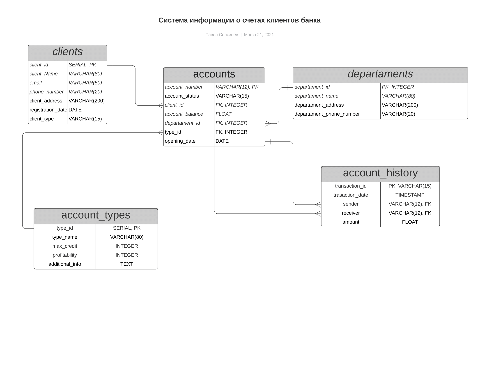

# JavaPrac

## Maven commands
```
mvn sql:execute@create-db
mvn sql:execute@drop-db
mvn sql:execute@init-db
mvn sql:execute@fill-db
mvn sql:execute@drop-db

mvn test
mvn package
```
## DB scheme



## Description

Read description.pdf
